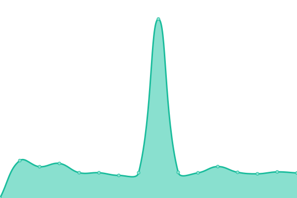

# [📈 Live Status](https://digital-land.github.io/service-status): <!--live status--> **🟩 All systems operational**

This repository contains the open-source uptime monitor and status page for [Digital Land](https://digital-land.github.io), powered by [Upptime](https://github.com/upptime/upptime).

With [Upptime](https://upptime.js.org), you can get your own unlimited and free uptime monitor and status page, powered entirely by a GitHub repository. We use [Issues](https://github.com/digital-land/service-status/issues) as incident reports, [Actions](https://github.com/digital-land/service-status/actions) as uptime monitors, and [Pages](https://digital-land.github.io/service-status) for the status page.

<!--start: status pages-->
<!-- This summary is generated by Upptime (https://github.com/upptime/upptime) -->
<!-- Do not edit this manually, your changes will be overwritten -->
<!-- prettier-ignore -->
| URL | Status | History | Response Time | Uptime |
| --- | ------ | ------- | ------------- | ------ |
|  [Platform](https://www.planning.data.gov.uk) | 🟩 Up | [platform.yml](https://github.com/digital-land/service-status/commits/HEAD/history/platform.yml) | 

 194ms
     
 | 

<a href="https://service-status.planning.data.gov.uk/history/platform">100.00%</a>
    

|  [Datasette API](https://datasette.planning.data.gov.uk) | 🟩 Up | [datasette-api.yml](https://github.com/digital-land/service-status/commits/HEAD/history/datasette-api.yml) | 

 250ms
     
 | 

<a href="https://service-status.planning.data.gov.uk/history/datasette-api">100.00%</a>
    

|  [Tiles Server](http://tiles.planning.data.gov.uk/article-4-direction-area/metadata.json) | 🟩 Up | [tiles-server.yml](https://github.com/digital-land/service-status/commits/HEAD/history/tiles-server.yml) | 

 661ms
     
 | 

<a href="https://service-status.planning.data.gov.uk/history/tiles-server">100.00%</a>
    

|  [Internal Status API](https://status.planning.data.gov.uk) | 🟩 Up | [internal-status-api.yml](https://github.com/digital-land/service-status/commits/HEAD/history/internal-status-api.yml) | 

 893ms
     
 | 

<a href="https://service-status.planning.data.gov.uk/history/internal-status-api">100.00%</a>
    

<!--end: status pages-->

[**Visit our status website →**](https://digital-land.github.io/service-status)

## 📄 License

- Powered by: [Upptime](https://github.com/upptime/upptime)
- Code: [MIT](./LICENSE) © [Digital Land](https://digital-land.github.io)
- Data in the `./history` directory: [Open Database License](https://opendatacommons.org/licenses/odbl/1-0/)
